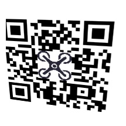
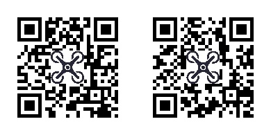
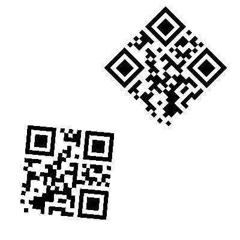
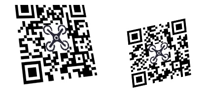
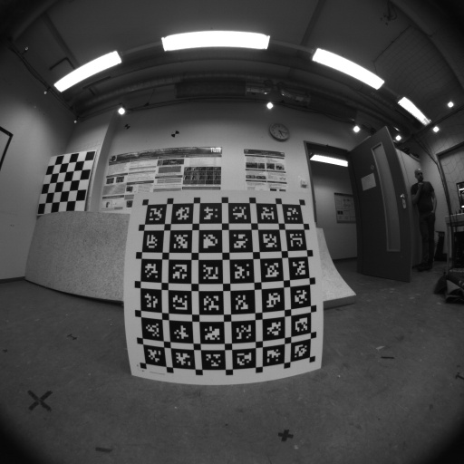
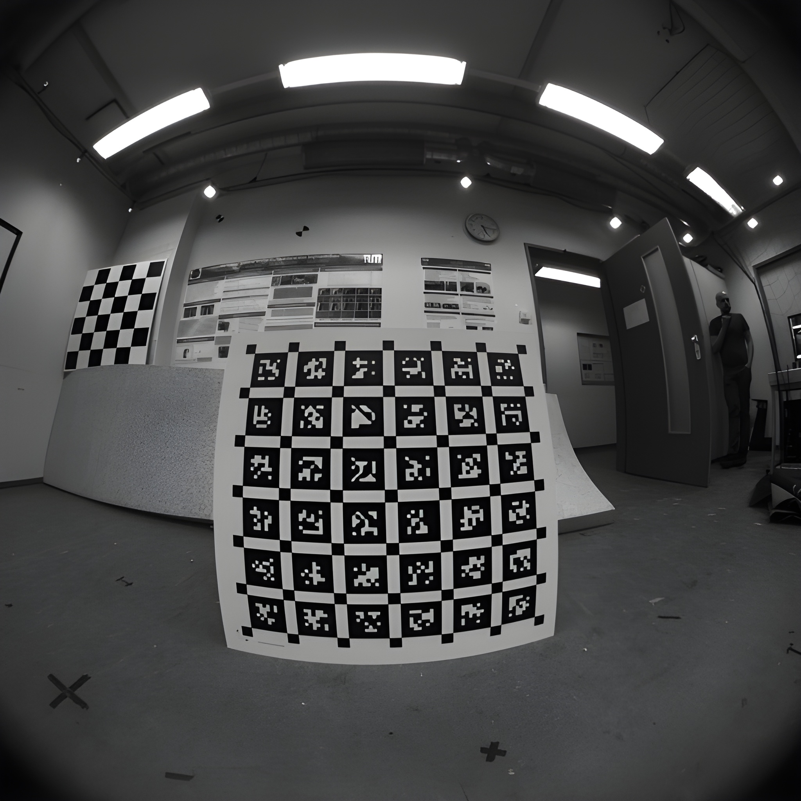

[toc]

# QRCode Recognize
QRCode二维码识别库效果简单对比
| Language | Library | Result | Speed |
|:---:|:---:|:---:|:---:|
| c++ | [ZXing](https://github.com/zxing-cpp/zxing-cpp) | Good, 好，都能正常识别 | Good |
| c | [ZBar](https://zbar.sourceforge.net/) | Build Bad | Normal |
| c++/python | opencv+wechat | Normal, 一般，多个码只识别到其中一个 | Normal |
| c++/python | cv2.QRCodeDetector | Normal, 一般，多个码识别失败 | Normal |
| python | [qreader](https://github.com/Eric-Canas/qreader) | Good, 好，多个码能识别，但内容可能识别失败 | Low |
| python | pyzbar | Bad, 差，略有倾斜的码都识别不了 | Normal |

其中`cv2.wechat_qrcode_WeChatQRCode`需要加载官方预训练模型[opencv_3rdparty](https://github.com/WeChatCV/opencv_3rdparty.git)且需要安装`opencv-contrib-python`，不同于`cv2.QRCodeDetector`环境安装`opencv-python`

## Result
### 测试图像1——倾斜：pyzbar和cv2.QRCodeDetector()识别失败，out!

### 测试图像2——一图多码：剩下的都能正常识别


### 测试图像3——自定义一图多码：qreader和cv2.wechat_qrcode_WeChatQRCode识别失败，out!
最终只有`ZXing`能都正常识别出来。



# fiducial marker 
[apriltag-imgs](https://github.com/AprilRobotics/apriltag-imgs)
以`Family = tag36h11`为测试图像。

| Language | Name | Result | Speed | Others |
|:---:|:---:|:---:|:---:|:---:|
| c++/python | [AprilTag](https://github.com/AprilRobotics/apriltag.git) | > 30x30 | Good | |
| c++/python | ArUco | > 35x35, in opencv | Good | |
| c++/python | WhyCode | | | pip install failed, 圆形标记 |
| c++ | [TopoTag](https://herohuyongtao.github.io/research/publications/topo-tag/) | - | - | 只有windows库，不开源 |
| c++ | [STag](https://github.com/manfredstoiber/stag) | - | SLOW | 圆形标记 |

其中`ArUco`需要安装`opencv-contrib-python`，不同于其它环境安装`opencv-python`

# Super-Resolution
以无人机定位地面上的apriltag点为需求，图像模糊检测tag失败，通过增加Super-Resolution操作，可以提升tag检测成功率。

使用[visual-inertial-dataset](https://cvg.cit.tum.de/data/datasets/visual-inertial-dataset)中`dataset-calib-cam2_512_16.bag`包中的图像作为测试数据集。使用[Real-ESRGAN](https://github.com/xinntao/Real-ESRGAN.git)或[SwinIR](https://github.com/JingyunLiang/SwinIR.git)或[DeepDeblur-PyTorch](https://github.com/SeungjunNah/DeepDeblur-PyTorch)做Super-Resolution。其中原图像使用apriltag和cv2.aruco均检测失败，而Super-Resolution新图像使用cv2.aruco可检测出一个id，apriltag依旧检测失败。




通过调整`cv2.aruco`的参数可以提高/降低经过`Super-Resolution`处理后的图像帧的识别率。默认参数如下。
```py
    import cv2; [print(f"{attr}: {getattr(cv2.aruco.DetectorParameters(), attr)}") for attr in dir(cv2.aruco.DetectorParameters()) if not attr.startswith('_')]
```
```sh
adaptiveThreshConstant: 7.0
adaptiveThreshWinSizeMax: 23
adaptiveThreshWinSizeMin: 3
adaptiveThreshWinSizeStep: 10
aprilTagCriticalRad: 0.1745329201221466
aprilTagDeglitch: 0
aprilTagMaxLineFitMse: 10.0
aprilTagMaxNmaxima: 10
aprilTagMinClusterPixels: 5
aprilTagMinWhiteBlackDiff: 5
aprilTagQuadDecimate: 0.0
aprilTagQuadSigma: 0.0
cornerRefinementMaxIterations: 30
cornerRefinementMethod: 0
cornerRefinementMinAccuracy: 0.1
cornerRefinementWinSize: 5
detectInvertedMarker: False
errorCorrectionRate: 0.6
markerBorderBits: 1
maxErroneousBitsInBorderRate: 0.35
maxMarkerPerimeterRate: 4.0
minCornerDistanceRate: 0.05
minDistanceToBorder: 3
minGroupDistance: 0.20999999344348907
minMarkerDistanceRate: 0.125
minMarkerLengthRatioOriginalImg: 0.0
minMarkerPerimeterRate: 0.03
minOtsuStdDev: 5.0
minSideLengthCanonicalImg: 32
perspectiveRemoveIgnoredMarginPerCell: 0.13
perspectiveRemovePixelPerCell: 4
polygonalApproxAccuracyRate: 0.03
readDetectorParameters: <built-in method readDetectorParameters of cv2.aruco.DetectorParameters object at 0x7f6df55c6e80>
relativeCornerRefinmentWinSize: 0.30000001192092896
useAruco3Detection: False
writeDetectorParameters: <built-in method writeDetectorParameters of cv2.aruco.DetectorParameters object at 0x7f6df55c6e80>
```

查看Apriltag的源码发现默认检测hamming距离最大为3。相当于精确匹配了。。。

而opencv的arucoDetector在c++中默认安装的不包含，需要勾选opencv_contrib源码编译安装。

# PnP
> b = (int)a c++/py 并不是四舍五入，而是取向0靠近的整数
## apriltag
返回结果按图像坐标系，图像左上角为原点
```c++
/*
o--------------> x
|
|
|
|
v
y
*/
```

# Source Code
## ZXing
```c++
#include <opencv2/opencv.hpp>
#include <opencv2/objdetect.hpp>
#include <iostream>

#include "ZXing/ReadBarcode.h"

int detectZXing(cv::Mat &cvImage) {
    int width = cvImage.cols, height = cvImage.rows;
    printf("width = %d, height = %d\n", width, height);
    auto image = ZXing::ImageView(cvImage.data, width, height, ZXing::ImageFormat::BGR);
    auto options = ZXing::ReaderOptions().setFormats(ZXing::BarcodeFormat::Any);
    auto barcodes = ZXing::ReadBarcodes(image, options);

    std::cout << "Detect count: " << barcodes.size() << std::endl;
    for (const auto& b : barcodes) {
        std::cout << ZXing::ToString(b.format()) << ": " << b.text() << "\n";
        std::cout << ZXing::ToString(b.position()) << std::endl;
    }
    return barcodes.size();
}

int main() {
    std::string sImagePath = "../.data/qrcode/3_selfdefine.jpg";
    cv::Mat image = cv::imread(sImagePath);
    int count = detectZXing(image);
    return 0;
}
```
## 其它
```py
import cv2
import numpy as np
import time

def detect_pyzbar(image):
    from pyzbar.pyzbar import decode

    decoded_objects = decode(image)

    texts = []
    boxes = []

    for obj in decoded_objects:
        texts.append(obj.data.decode('utf-8'))
    return texts, boxes

def detect_qreader(image):
    from qreader import QReader
    
    qreader = QReader()
    texts = []
    boxes = []
    detections = qreader.detect(image=image)
    if detections is not None:
        for det in detections:
            decoded_text = qreader.decode(image, det)
            decoded_box = det['bbox_xyxy']
            texts.append(decoded_text)
            boxes.append(decoded_box)
    return texts, boxes

def detect_opencv(image):
    detector = cv2.QRCodeDetector()
    
    decodeed_text, points, _ = detector.detectAndDecode(image)
    texts = [decodeed_text]
    boxes = []
    drawn_img = image.copy() # Create a copy of the image to draw on

    if points is not None:
        print(f"points not none")
        points = points.astype(np.int32)
        for i, qr_points in enumerate(points):
            # The points for one QR code are a 2D array of shape (4, 2).
            # We need to reshape it to the format expected by the decode function.
            qr_points_reshaped = qr_points.reshape((-1, 1, 2))
            # Draw the bounding box on the image (in green, thickness of 2)
            cv2.polylines(drawn_img, [qr_points_reshaped], isClosed=True, color=(0, 255, 0), thickness=2)
            
            # Optional: Add a label number
            centroid = np.mean(qr_points, axis=0).astype(int).flatten()
            cv2.putText(drawn_img, str(i+1), tuple(centroid), cv2.FONT_HERSHEY_SIMPLEX, 0.7, (0, 0, 255), 2)
            
    return texts, boxes

# need opencv-contrib-python instead opencv-python
def detect_wechat(image):
    model_dir = "../opencv_3rdparty/" 
    detector = cv2.wechat_qrcode_WeChatQRCode(
        model_dir + "detect.prototxt",
        model_dir + "detect.caffemodel",
        model_dir + "sr.prototxt",
        model_dir + "sr.caffemodel"
    )
    texts = []
    boxes = []
    res, points = detector.detectAndDecode(image)

    print(len(res))
    if len(res) > 0:
        for i, (text, point_set) in enumerate(zip(res, points)):
            texts.append(text)
            boxes.append(point_set)
            
            if point_set.ndim == 3 and point_set.shape[1] == 4 and point_set.shape[2] == 2:
                points_reshaped = point_set.reshape(4, 2).astype(int)
            else:
                points_reshaped = point_set.astype(int)
            
            for j in range(4):
                start_point = tuple(points_reshaped[j])
                end_point = tuple(points_reshaped[(j + 1) % 4])
                cv2.line(image, start_point, end_point, (0, 255, 0), 2)
            
            cv2.putText(image, f"QR: {text}", tuple(points_reshaped[0]),
                    cv2.FONT_HERSHEY_SIMPLEX, 0.5, (0, 0, 255), 2)
    return texts, boxes

def unit_test(image, func):
    texts, boxes = func(image)
    print(texts, boxes)

if __name__ == '__main__':
    start_time = time.time()

    # failed
    # unit_test(cv2.imread('.data/qrcode/1_distort.jpg'), detect_pyzbar)

    # failed
    # unit_test(cv2.imread('.data/qrcode/1_distort.jpg'), detect_opencv)

    # multi_code success
    # unit_test(cv2.imread('1_distort.jpg'), detect_qreader)
    # unit_test(cv2.imread('.data/qrcode/2_multicode.png'), detect_qreader)
    # unit_test(cv2.imread('.data/qrcode/2_multicode_normal.jpg'), detect_qreader)
    # multi_code failed, miss one text 
    # unit_test(cv2.imread('.data/qrcode/3_selfdefine.jpg'), detect_qreader)
    '''
    [None, 'This is Image 2'] [array([      30.58,      9.8294,      197.52,      171.39], dtype=float32), array([     257.03,      37.019,      388.42,      178.48], dtype=float32)]
    '''

    # multi_code success
    # unit_test(cv2.imread('.data/qrcode/2_multicode_normal.jpg'), detect_wechat)
    # multi_code failed, only one detect 
    # unit_test(cv2.imread('.data/qrcode/2_multicode.png'), detect_wechat)
```